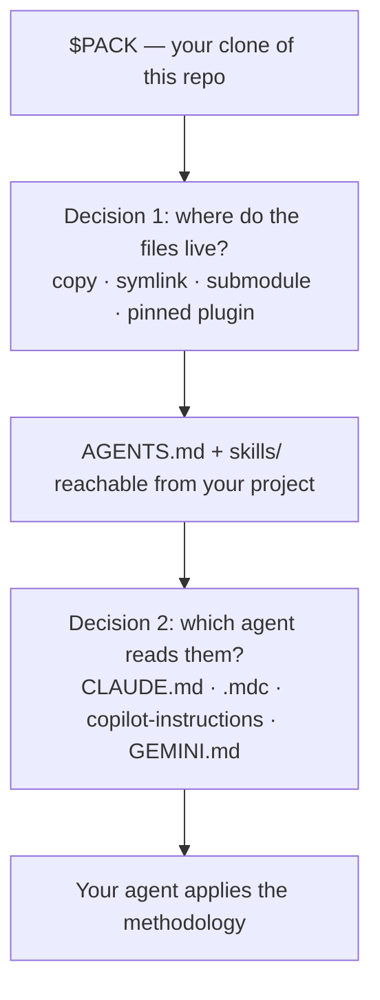
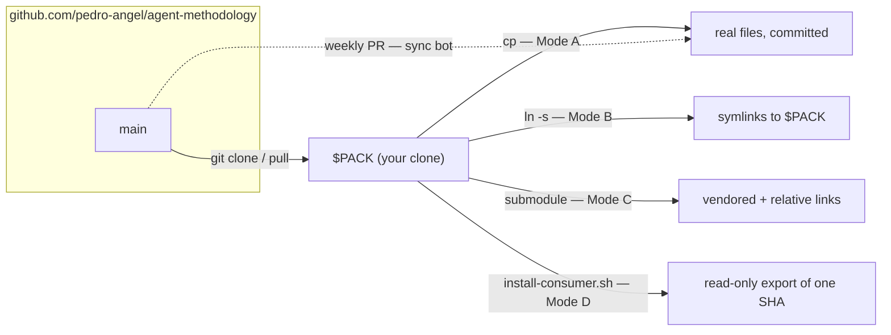
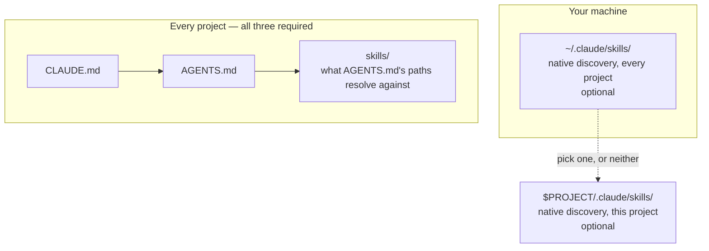
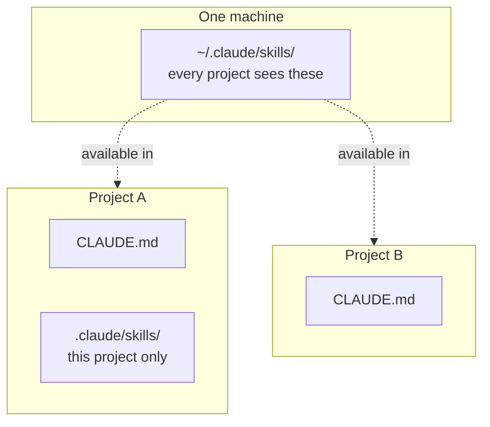
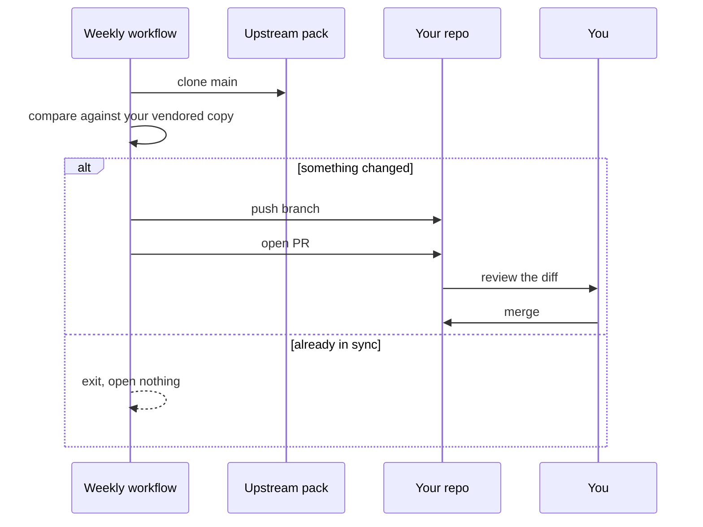

# INSTALL

Installing this pack means putting two things where your agent will read them — `AGENTS.md` and the `skills/` directory — and then adding whatever small file your particular agent looks for.

There is no package manager, no runtime, and nothing installed globally on your behalf. It is a git repo full of Markdown.

## Before anything: get the pack

Every command below refers to `$PACK`. It doesn't exist until you clone the repo, and you repeat this on each machine you work from:

```bash
git clone https://github.com/pedro-angel/agent-methodology ~/agent-methodology
export PACK=~/agent-methodology
export PROJECT=/path/to/your/project
```

Keep both variables exported for the whole session; every block below reuses them.

## The two decisions

Installing involves two independent choices. Mixing them up is the usual source of confusion:



**Decision 1 determines how updates reach you.** **Decision 2 determines which tool sees the rules.** They are orthogonal — any mode works with any agent, and one project can wire several agents at once.

## Step 1 — Put the files where the project can reach them

Pick one mode. If you're unsure, pick **Copy**; switching later is a documented, reversible move.

### Mode A — Copy (start here)

Real files, committed to your repo. Self-contained, works for every collaborator, goes stale until you re-sync.

```bash
cp "$PACK/AGENTS.md" "$PROJECT/AGENTS.md"
mkdir -p "$PROJECT/skills" && cp -R "$PACK/skills/." "$PROJECT/skills/"
```

Updates arrive when you re-run those two commands (`cp` overwrites in place), or automatically via the [sync bot](#sync-bot-copy--a-weekly-pr).

### Mode B — Symlink

Your project links to your clone. Edit the clone once and every linked project sees it instantly. Best for a solo machine with many projects.

```bash
ln -s "$PACK/AGENTS.md" "$PROJECT/AGENTS.md"
ln -s "$PACK/skills"    "$PROJECT/skills"
```

Updates arrive when you `git -C "$PACK" pull`. Nothing to re-run per project.

**Caveat:** a committed symlink with an absolute target breaks for any collaborator whose clone lives elsewhere. Use this on repos that stay on your machines, or use Mode C.

### Mode C — Git submodule

The pack is vendored inside your repo at a fixed path, so relative symlinks resolve for everyone who clones it.

```bash
cd "$PROJECT"
git submodule add https://github.com/pedro-angel/agent-methodology vendor/agent-methodology
ln -s vendor/agent-methodology/AGENTS.md AGENTS.md
ln -s vendor/agent-methodology/skills    skills
```

Updates arrive when you run `git submodule update --remote` and commit the moved pointer.

### Mode D — Pinned plugin (audited)

Freeze one specific commit instead of tracking a working tree, so what runs is always an immutable, reviewed export. Pick this on any machine where you want to audit exactly what your agent consumes; it is Claude Code-specific. Full commands are in [Tag-pinned plugin (audited, immutable consumption)](#tag-pinned-plugin-audited-immutable-consumption) below.

### How the modes compare



Only the sync bot pushes updates toward you. Every other mode waits for you to pull.

## Tag-pinned plugin (audited, immutable consumption)

Mode D in full: **[docs/pinned-install.md](docs/pinned-install.md) is the complete step-by-step** — from a bare user to a verified install, with exclusions, the always-on rules, a one-command `bump`, verification, rollback, and uninstall. Every block in it was executed verbatim on a fresh user before it was published.

The shape: `tools/consume/install-consumer.sh` exports one specific commit into a read-only directory with no `.git`, links it into your Claude config as a single plugin, and installs a boot check that runs at session start. Updates arrive only when you approve a new commit — a bump is a reviewed move to a new SHA, never a live `git pull` — and the boot check lives outside the tier it verifies, so a broken install cannot disable its own alarm.

Provisioning needs `jq` or `python3` for a safe `settings.json` merge; the runtime path needs neither. Developing the pack itself still uses a plain checkout — this mode is for users that *consume* the methodology. Migrating an existing non-pinned install is a cutover, not a fresh install: see [docs/cutover-runbook.md](docs/cutover-runbook.md).

## Step 2 — Wire your agent

Each agent looks for its own file. Install as many as you use; they don't conflict.

| Agent | Reads | Install |
| --- | --- | --- |
| Claude Code | `CLAUDE.md` at the project root | `cp "$PACK/adapters/claude/CLAUDE.md" "$PROJECT/CLAUDE.md"` |
| Cursor | `.cursor/rules/methodology.mdc` | `mkdir -p "$PROJECT/.cursor/rules" && cp "$PACK/adapters/cursor/methodology.mdc" "$PROJECT/.cursor/rules/methodology.mdc"` |
| GitHub Copilot | `.github/copilot-instructions.md` | `mkdir -p "$PROJECT/.github" && cp "$PACK/adapters/copilot/copilot-instructions.md" "$PROJECT/.github/copilot-instructions.md"` |
| Gemini CLI | `GEMINI.md` at the project root | `cp "$PACK/adapters/gemini/GEMINI.md" "$PROJECT/GEMINI.md"` |
| Codex | `AGENTS.md` — natively | nothing; Step 1 covered it |

For any other agent, create whatever instruction file it expects and make it a one-liner:

```text
Follow the methodology in ./AGENTS.md. For each task, load the matching skills/<slug>/SKILL.md before acting.
```

Keep custom adapters thin — a pointer, not a copy of the rules. The bundled Cursor and Copilot adapters are the deliberate exception: those tools don't reliably follow a bare pointer, so they inline a condensed index derived from `AGENTS.md`, and CI fails if that index drifts.

### Claude Code: one project, or every project

This is the distinction that trips people, and skills can live in three different places that do three different jobs. Getting them confused is the most common broken install.

| Location | Job | Required? |
| --- | --- | --- |
| `$PROJECT/skills/` | what the `skills/<slug>/SKILL.md` references in `AGENTS.md` resolve against; the only one non-Claude agents read | **always** |
| `~/.claude/skills/` | registers them as native Claude Code skills in **every** project | optional |
| `$PROJECT/.claude/skills/` | registers them as native Claude Code skills in **this** project | optional |

**The optional two are additions, not replacements.** Installing skills under `~/.claude/skills/` does not let you skip `$PROJECT/skills/` — drop that and the path references in `AGENTS.md` dangle, and any non-Claude agent in the repo sees nothing.

**Pick at most one of the optional two.** Having both `~/.claude/skills/` and `$PROJECT/.claude/skills/` gives the agent duplicates of every skill.



So a fresh laptop takes one clone, optionally one machine-wide skills copy, and then three files per project:



```bash
# once per machine — optional native discovery everywhere:
mkdir -p ~/.claude/skills && cp -R "$PACK/skills/." ~/.claude/skills/

# then, per project, all three — none of these are optional:
cp "$PACK/AGENTS.md" "$PROJECT/AGENTS.md"
cp "$PACK/adapters/claude/CLAUDE.md" "$PROJECT/CLAUDE.md"
mkdir -p "$PROJECT/skills" && cp -R "$PACK/skills/." "$PROJECT/skills/"
```

If you already have skills in **both** optional locations, delete the project-level one. Your repo's `skills/` directory — a different path, which other agents and contributors read — is unaffected:

```bash
git rm -r "$PROJECT/.claude/skills"
```

To check which optional location you're using, on this machine or three months from now:

```bash
ls -d ~/.claude/skills "$PROJECT/.claude/skills" 2>/dev/null
```

## Step 3 — Verify it took

First check the files are where the agent looks:

```bash
ls -l "$PROJECT/AGENTS.md" 2>&1
ls -l "$PROJECT/CLAUDE.md" 2>&1              # or the path for your agent
ls -d "$PROJECT/skills" 2>/dev/null || ls ~/.claude/skills >/dev/null 2>&1 \
  && echo "skills reachable" || echo "skills MISSING in both locations"
```

Then check the agent actually engages it. Start your agent in the project directory — for Claude Code that is `cd "$PROJECT" && claude` — and ask:

> Which methodology skills apply here, and what does each require?

A correct install answers by citing `AGENTS.md` and reading the relevant `skills/<slug>/SKILL.md` before proposing any code. If it doesn't, the file landed somewhere that agent doesn't read — recheck the path in the Step 2 table.

## Keeping it up to date

Every mode starts the same way — refresh your clone. `git clone` is a one-time act; from then on it is `git pull`:

```bash
git -C "$PACK" pull
```

| Mode | Then, to update | Effort |
| --- | --- | --- |
| Copy | re-run the copy commands below, per project | manual, per project |
| Sync bot | merge the PR it opens | review only |
| Symlink | nothing — the pull already did it | one command, all projects |
| Submodule | `git submodule update --remote` and commit | one command, per repo |
| Pinned plugin | approve and bump to a new SHA | deliberate, audited |

In Copy mode, "re-run the copy commands" is the same three lines you installed with. Nothing is conditional, and re-running is safe — every command overwrites in place:

```bash
export PACK=~/agent-methodology          # re-export; shell variables don't survive a session
git -C "$PACK" pull

for PROJECT in ~/code/project-a ~/code/project-b; do
  cp "$PACK/AGENTS.md" "$PROJECT/AGENTS.md"
  cp "$PACK/adapters/claude/CLAUDE.md" "$PROJECT/CLAUDE.md"
  cp -R "$PACK/skills/." "$PROJECT/skills/"
done

# only if you also installed the optional machine-wide copy:
[ -d ~/.claude/skills ] && cp -R "$PACK/skills/." ~/.claude/skills/
```

Because the rules live only in `AGENTS.md` and the `SKILL.md` files, an update never has to touch a per-agent adapter.

### Sync bot: copy + a weekly PR

For shared repos that must vendor real files, copy [`templates/methodology-sync.yml`](templates/methodology-sync.yml) into your repo as `.github/workflows/methodology-sync.yml`. Each week it re-syncs `AGENTS.md`, `skills/`, and your adapter from this pack's main, and opens a PR only when something changed:



**Before you rely on it, know that a repository setting can block it entirely.** A workflow's job-level `pull-requests: write` grant is not sufficient on its own. With *Settings → Actions → General → Workflow permissions → "Allow GitHub Actions to create and approve pull requests"* unchecked, the job pushes its branch and then dies:

```text
GitHub Actions is not permitted to create or approve pull requests.
```

Check the flag with:

```bash
gh api repos/OWNER/REPO/actions/permissions/workflow --jq .can_approve_pull_request_reviews
```

The failure is silent by construction — the branch still updates weekly, so the repo looks covered while no PR ever appears. Watch the Actions tab after the first real delta, not just the first dispatch: a dispatch on an already-in-sync repo runs green and opens nothing, which is indistinguishable from a run that could not open anything.

**Enabling that flag is not the whole fix, and it may not be the fix you want.** It is a single checkbox granting two capabilities — creating pull requests *and* approving them — with no way to take only the first. And GitHub does not run `on: pull_request` workflows for pull requests created with the built-in `GITHUB_TOKEN`, so the bot's PR arrives with no CI attached; if your branch protection requires a status check, that PR can never merge. Two ways around it:

- **Give the bot its own identity.** Pass a fine-grained PAT or a GitHub App token to the `create-pull-request` step. A PR authored by a non-`GITHUB_TOKEN` identity does trigger your checks, and the repository flag stays off. Costs you a secret to store and rotate.
- **Don't have it open a PR.** Have the workflow open an *issue* when it detects drift (`issues: write` needs no special flag) and do the sync yourself through your normal review flow. No new credential, no new capability.

## Switching modes later

- **Copy → sync bot:** add the workflow. Its first run PRs the delta between your copy and current main; merging that PR *is* the catch-up.
- **Copy → symlink:** `git rm -r` the vendored files, then create the links from Mode B. Only for repos that never leave machines where `$PACK` exists.
- **Symlink → copy** (a collaborator joined): delete the links **first**, then copy. Order matters — copying onto an existing symlink follows the link and writes into the pack itself.

  ```bash
  rm "$PROJECT/AGENTS.md" "$PROJECT/CLAUDE.md" "$PROJECT/skills"   # removes links, not content
  cp "$PACK/AGENTS.md" "$PROJECT/AGENTS.md"
  mkdir -p "$PROJECT/skills" && cp -R "$PACK/skills/." "$PROJECT/skills/"
  cp "$PACK/adapters/claude/CLAUDE.md" "$PROJECT/CLAUDE.md"
  ```

## Troubleshooting

| Symptom | Likely cause |
| --- | --- |
| Agent ignores the methodology entirely | The file isn't at the path that agent reads — check the Step 2 table |
| Claude Code shows every skill twice | Skills in both optional locations — `~/.claude/skills/` and `$PROJECT/.claude/skills/`. Keep one. `$PROJECT/skills/` is a third, separate path and is not the cause |
| Agent finds `AGENTS.md` but can't open a `SKILL.md` | `$PROJECT/skills/` is missing — a machine-wide install does not replace it |
| Your edits to the pack don't appear in a project | You're in Copy mode; re-run the copy commands, or switch to Symlink |
| Sync bot never opens a PR | The repository PR-creation flag is off — see the sync bot section |
| Symlinks broken after cloning on another machine | Absolute symlink targets — use a submodule (Mode C) or copy |

## Installing alongside the git controls

This pack and [git-controls-starter](https://github.com/pedro-angel/git-controls-starter) are complementary and don't overlap. The starter owns the git gate (`.pre-commit-config.yaml`, `scripts/checks/`, CI workflows); this pack owns the prose (`AGENTS.md`, `skills/`, adapters). Install in either order. For the controls, prefer the starter's remote-consumption mode (its README, mode 1); [`templates/git-controls/`](templates/git-controls/) here is an offline-vendorable copy for when you can't consume remotely.

## What's in the pack

```text
AGENTS.md                         the methodology — canonical
skills/<slug>/SKILL.md            one directory per skill: rules, red flags, examples
adapters/claude/CLAUDE.md         thin pointer: "read AGENTS.md, load the matching skill"
adapters/gemini/GEMINI.md         thin pointer
adapters/cursor/methodology.mdc   condensed index (Cursor doesn't follow bare pointers)
adapters/copilot/…                condensed index (same reason)
templates/methodology-sync.yml    the weekly sync-bot workflow
templates/git-controls/           offline-vendorable copy of the git controls
tools/consume/                    scripts behind the pinned-plugin mode
```

---

Released under the [MIT License](LICENSE) — copy it into your own projects, proprietary ones included, freely. The rules were distilled from real builds, used only as illustrative sources; you need to know nothing about either to install or apply the pack.
