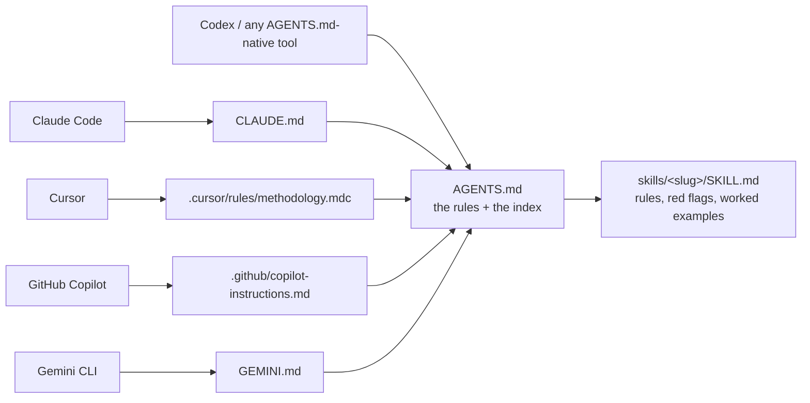
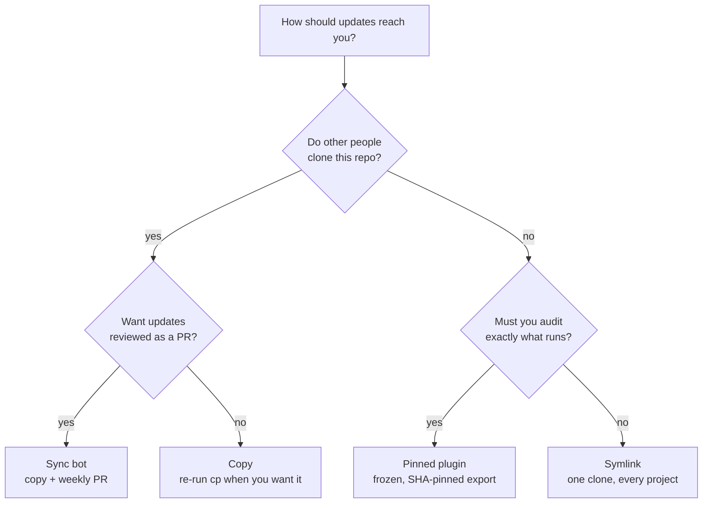

# Agent Methodology

[](https://github.com/pedro-angel/agent-methodology/actions/workflows/checks.yml)
[](LICENSE)

A set of engineering rules your AI coding agent reads before it works — so it writes the spec first, proves integrations against real infrastructure, and pauses before anything irreversible. Plain Markdown, no runtime, no dependencies. Works with Claude Code, Cursor, GitHub Copilot, Gemini CLI, Codex, or anything that reads a file.

## Install

Clone the pack once per machine, then wire each project:

```bash
git clone https://github.com/pedro-angel/agent-methodology ~/agent-methodology
export PACK=~/agent-methodology
export PROJECT=/path/to/your/project

cp "$PACK/AGENTS.md" "$PROJECT/AGENTS.md"                                # the rules
cp "$PACK/adapters/claude/CLAUDE.md" "$PROJECT/CLAUDE.md"                # or cursor / copilot / gemini
mkdir -p "$PROJECT/skills" && cp -R "$PACK/skills/." "$PROJECT/skills/"  # the detail behind each rule
```

**There is no global install.** Those three files are needed in every project you want covered:

| Piece | Where it goes | What it does |
| --- | --- | --- |
| Your clone (`$PACK`) | once per machine | the source you copy from |
| `AGENTS.md` | **every project** | the rules; the adapter reads it from the project root |
| Adapter (`CLAUDE.md`, `.mdc`, …) | **every project** | the file your agent looks for |
| `skills/` | **every project** | what the `skills/<slug>/SKILL.md` references resolve against |
| `~/.claude/skills/` | once per machine, optional | *adds* native skill discovery in Claude Code, everywhere |

That last row is an **addition, not a replacement**. It registers the skills as natively invokable in Claude Code across all your projects; it does not remove the need for the three per-project files.

```bash
mkdir -p ~/.claude/skills && cp -R "$PACK/skills/." ~/.claude/skills/
```

Commit `AGENTS.md`, the adapter, and `skills/` to your repo — collaborators and CI need them too.

A second computer means repeating the `git clone` there. The copy above is one of four install modes; it's the right default, and [INSTALL.md](INSTALL.md) covers the others (symlink, submodule, pinned) along with every agent and how updates reach you.

## How the pieces fit

`AGENTS.md` holds the rules. Each rule has a full `SKILL.md` behind it. Every agent reaches the same two things through whatever file that agent happens to read:



You edit `AGENTS.md` and the skill files. You almost never touch an adapter — that is what keeps one pack working across every agent.

Two adapters are a deliberate exception. Cursor and Copilot don't reliably follow a bare pointer to another file, so their adapters inline a condensed index of every rule. A CI check fails the build if that index drifts from the source.

## Which install mode do you want?

The files can live in your project four different ways. They differ only in **how an update reaches you**:

| Mode | Files in your repo are… | An update arrives when… | Use it when |
| --- | --- | --- | --- |
| **Copy** | real, committed files | you re-run the copy commands | trying it out; a repo others clone |
| **Sync bot** | real, committed files | a weekly workflow opens a PR | a shared repo that must vendor real files |
| **Symlink** | links to your local clone | you `git pull` the clone | solo machine, many projects, one checkout |
| **Pinned plugin** | a link to a frozen export | you review and approve a new commit | you want to audit exactly what runs |



Full commands for each are in [INSTALL.md](INSTALL.md).

## The rules

Twenty-two skills. Match your task to one or more — most non-trivial work touches two or three — then read that `SKILL.md` in full before acting.

### Designing before building

| Skill | Use it when |
| --- | --- |
| [spec-driven-development](skills/spec-driven-development/SKILL.md) | Starting a non-trivial feature, or docs and code have drifted apart |
| [environment-research](skills/environment-research/SKILL.md) | About to design on top of a dependency whose real behavior you haven't watched |
| [adversarial-lens-review](skills/adversarial-lens-review/SKILL.md) | A spec, plan, or diff must be trusted before it advances |
| [decision-memory](skills/decision-memory/SKILL.md) | A decision would otherwise be re-derived from scratch next session |

### Structuring the system

| Skill | Use it when |
| --- | --- |
| [hexagonal-with-enforced-contracts](skills/hexagonal-with-enforced-contracts/SKILL.md) | The app touches external systems — databases, LLMs, cloud SDKs, HTTP APIs |
| [configuration-single-source-of-truth](skills/configuration-single-source-of-truth/SKILL.md) | A value is about to be duplicated across scripts, code, docs, and CI |
| [dev-environment-facade](skills/dev-environment-facade/SKILL.md) | Wiring the dev workflow — local stack, test tiers, gate commands |

### Changing code without breaking it

| Skill | Use it when |
| --- | --- |
| [surgical-changes-with-checkpoints](skills/surgical-changes-with-checkpoints/SKILL.md) | Every edit — smallest correct diff, checkpoint before risky work |
| [additive-default-off-feature-flags](skills/additive-default-off-feature-flags/SKILL.md) | Adding a capability to something that already works |
| [currency-and-audit-before-trust](skills/currency-and-audit-before-trust/SKILL.md) | Reusing inherited code, or making a security-relevant claim |

### Proving it actually works

| Skill | Use it when |
| --- | --- |
| [battle-testing-on-real-infra](skills/battle-testing-on-real-infra/SKILL.md) | About to call an integration or deployment "done" |
| [acceptance-tests-observable-outcomes](skills/acceptance-tests-observable-outcomes/SKILL.md) | Proving a feature delivers its outcome, not just that its code runs |
| [grounded-verifiable-gates](skills/grounded-verifiable-gates/SKILL.md) | An LLM's output decides what happens next |
| [definition-of-done-tooling](skills/definition-of-done-tooling/SKILL.md) | About to claim work is complete or shippable |
| [honest-reframing-over-overclaiming](skills/honest-reframing-over-overclaiming/SKILL.md) | A live result contradicts the story you hoped to tell |

### Working with humans and other agents

| Skill | Use it when |
| --- | --- |
| [evidence-over-deference](skills/evidence-over-deference/SKILL.md) | A request rests on a premise you can check, or a direction you haven't weighed |
| [reversible-by-default-confirm-consequential](skills/reversible-by-default-confirm-consequential/SKILL.md) | An agent can touch systems you don't own |
| [parallel-agent-fan-out](skills/parallel-agent-fan-out/SKILL.md) | Fanning out many write-capable sub-agents across one build |
| [autonomous-self-improvement-loop-safety](skills/autonomous-self-improvement-loop-safety/SKILL.md) | Building automation that edits, tests, or deploys itself |

### Security, secrets, and handoff

| Skill | Use it when |
| --- | --- |
| [structural-security-boundary](skills/structural-security-boundary/SKILL.md) | Containing untrusted or agent-generated execution |
| [secrets-and-teardown-discipline](skills/secrets-and-teardown-discipline/SKILL.md) | Handling credentials, infrastructure-as-code, or ephemeral cloud |
| [docs-as-deliverable](skills/docs-as-deliverable/SKILL.md) | Shipping or handing off code |

Beyond the skills, `AGENTS.md` carries a short set of **every-turn rules** — how an agent writes to you, on every reply. They live in always-loaded text rather than a skill because writing to a human never announces itself as a task, so nothing would ever trigger a skill to load.

## What's in this repo

```text
AGENTS.md        The methodology itself. Canonical — everything else points here.
skills/          One directory per skill; each holds a SKILL.md.
adapters/        Per-agent entry points (claude, cursor, copilot, gemini).
INSTALL.md       Every install mode, in full.
docs/            Maintainer notes (which tier a lesson belongs in).
templates/       Drop-in workflow + the git controls that guard this repo.
tools/consume/   Scripts behind the pinned-plugin mode.
scripts/checks/  The validators CI runs on this repo.
claude-tier/     Scaffold for Claude-only rules (currently empty by design).
design-chain/    The spec → design → tasks trail behind past changes.
```

## Deterministic git controls (optional)

[`templates/git-controls/`](templates/git-controls/) packages the machine checks that guard this repo — a pinned pre-commit config, a CI workflow, and zero-dependency POSIX-sh validators. Drop them into any prose- or spec-shaped repo and a broken invariant fails like a red build instead of slipping past review. See its [INSTALL](templates/git-controls/INSTALL.md).

## Philosophy

- **Process before code.** Run the relevant process skill *before* implementing — don't back-fill the design afterward.
- **Machines enforce, not memory.** A linter, a gate, an eval harness — encode the discipline so it survives the next contributor who didn't read this.
- **Reality is the only proof.** Mocks prove wiring; only a live run proves the guarantee. An unverified claim is a hope.
- **Reversible by default, a human on the irreversible 1%.** Cheap, undoable work flows freely; consequential acts pause for approval.

## Where these rules came from

Every rule survived a real build. Primarily a shipped, hexagonal, human-in-the-loop AI agent deployed to a serverless cloud runtime, behind a framework-free domain, with a CI-able eval harness gating its LLM decisions. The fan-out and large-surface live-testing rules came from a second build: a REST API client covering an external system's full API against a containerized live server.

Both appear only as illustrative examples, genericized. **You never need to know either project to apply a rule** — nothing here assumes a language, framework, or agent runtime.

## License, contributing, and prior art

Released under the [MIT License](LICENSE) — copy it into your own projects, proprietary ones included, with no obligation beyond keeping the copyright notice. Contributions welcome; see [CONTRIBUTING.md](CONTRIBUTING.md).

This pack follows two open conventions it does not own: the [`AGENTS.md`](https://agents.md) root-instruction convention, and the `skills/<slug>/SKILL.md` Agent Skills format. The methodology content is original.

Four skills — [environment-research](skills/environment-research/SKILL.md), [adversarial-lens-review](skills/adversarial-lens-review/SKILL.md), [acceptance-tests-observable-outcomes](skills/acceptance-tests-observable-outcomes/SKILL.md), and [definition-of-done-tooling](skills/definition-of-done-tooling/SKILL.md) — are adapted from [cmanaha/extended-superpowers](https://github.com/cmanaha/extended-superpowers) (MIT), rewritten from scratch in this pack's action-first, agent-agnostic voice. Each carries its own attribution note.

*Claude, Cursor, GitHub Copilot, and Gemini are trademarks of their respective owners; this project is independent and not affiliated with or endorsed by any of them.*
